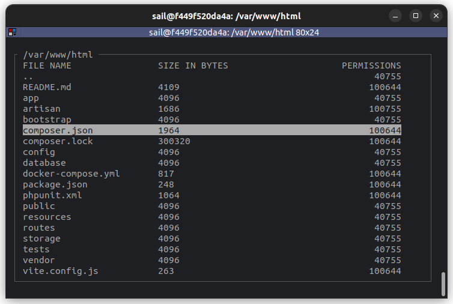

<div style="text-align:center">
    
</div>

### Simple Example usage:
```php
use function Knobik\Prompts\explorer;

$result = explorer(
    items: [
        [1, 'John Doe', 'john.doe@example.com'],
        [2, 'Jane Doe', 'jane.doe@example.com'],
        [3, 'Jan Kowalski', 'kowalski@example.com'],
    ],
    title: 'Hello from a explorer window'
    header: [
        'ID',
        'Name',
        'Email',
    ],
)
    ->prompt();
```

### Filtering
You can filter on your data by pressing forward slash `/`

### Advanced file explorer example:
```php
use function Knobik\Prompts\explorer;

function getDirectoryFiles(string $path): array
{
    $files = collect(glob("{$path}/*"))
        ->mapWithKeys(function (string $filename) {
            return [
                $filename => [
                    'filename' => basename($filename),
                    'size' => filesize($filename),
                    'permissions' => sprintf('%o', fileperms($filename)),
                ]
            ];
        });

    if ($path !== '/') {
        $files->prepend([
            'filename' => '..',
            'size' => null,
            'permissions' => sprintf('%o', fileperms(dirname($path)))
        ], dirname($path));
    }

    return $files->toArray();
}

$path = '/var/www/html';
while (true) {
    $newPath = explorer(
        items: $this->getDirectoryFiles($path),
        title: $path, //fn(ExplorerPrompt $prompt) => $prompt->highlighted,
        header: [
            'File name',
            'Size in bytes',
            'Permissions'
        ],
    )
        ->setFiltering(true)
        ->setColumnOptions(
            column: 2,
            width: 20, // number of characters, null to keep it in auto mode
            align: ColumnAlign::RIGHT,
            filterable: false 
        )
        ->prompt();

    if ($newPath === null) {
        continue; // no item selected
    }
    $path = $newPath;

    if (is_file($path)) {
        $this->line(file_get_contents($path));
        return self::SUCCESS;
    }
}
```
